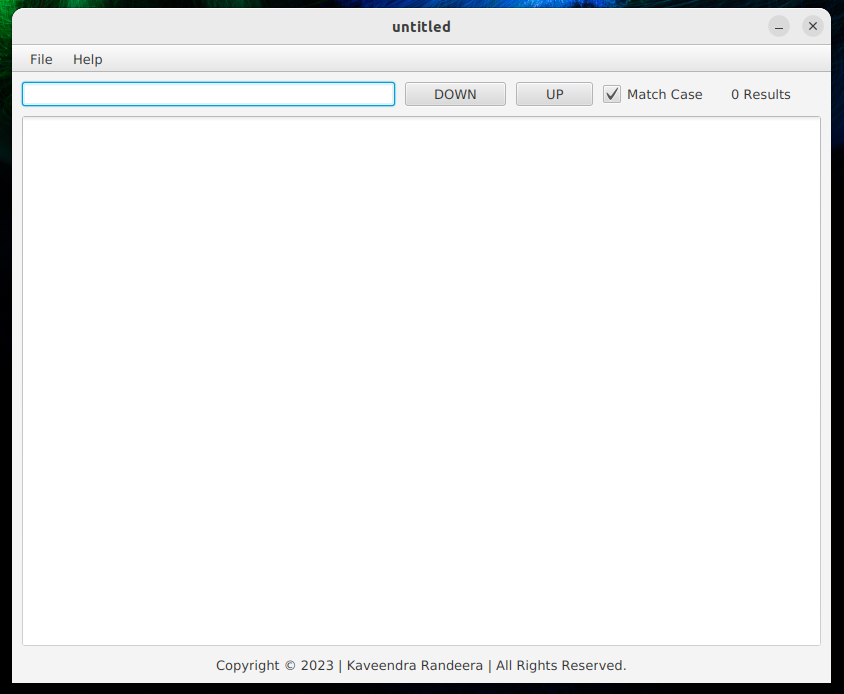
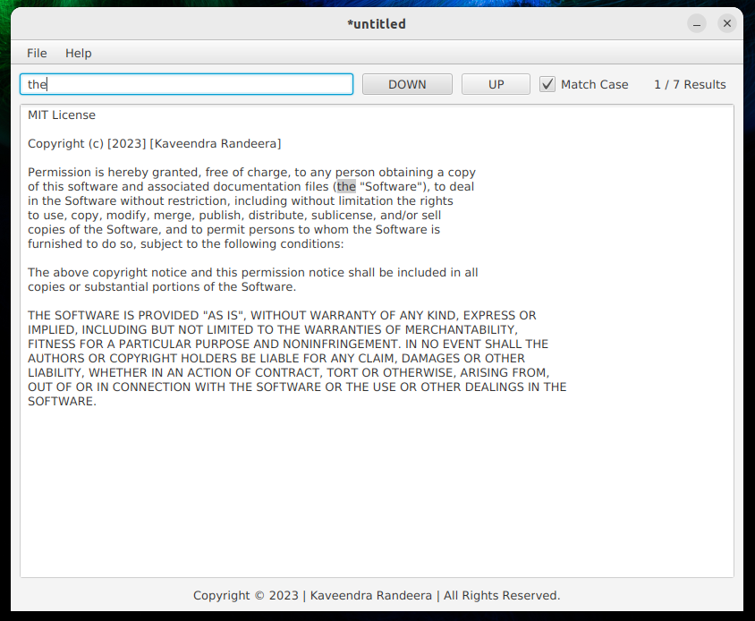

# 🖹 Simple Text Editor App
## Welcome to My Text Editor Application Project !
During my training period at the Institute of Software Engineering (IJSE),
I developed a user-friendly text editor application as a Fullstack Developer trainee.
This application enables users to perform various text editing tasks, including opening
any text file on their computer, editing its content, saving changes, saving as a 
different file name, finding words, and even opening files using a drag-and-drop
feature. The primary goal of this application is to provide a simple yet efficient tool for editing
text files, enhancing user productivity and ease of use.

I undertook this project with a specific focus on honing my skills in 
Java SE file I/O operations and regular expressions. By implementing the 
file opening and saving functionality, I deepened my understanding of 
reading and writing files in Java. Furthermore, the find feature allowed
me to apply regular expressions effectively for searching and manipulating
text within the editor.

As I look forward to expanding the capabilities of this application, 
I am committed to further enhancing my skills and knowledge in the realm of text editors. I welcome any suggestions for future improvements as I strive to learn and grow through this project.

### ☛ Images




## Video Preview

Click [here](src/main/resources/video/1.webm) to watch a demo of the Color Chooser App.


### ☛ Languages Used
1. Java 11

### ☛ Technology Used
1. Java FX
2. Java SE
3. Scene Builder

### ☛ IDE (Integrated Development Environment)
IntelliJ IDEA Ultimate Edition

### ☛ How to try this project

To try out the project, please follow these Git commands in your terminal:
1. Clone the Project
   ```
   https://github.com/randeera/k-soft-simple-text-editor.git
   ```
2. Build the project from parent folder
   ```
   mvn clean install
   ```

3. Then execute the AppInitializerWrapper class<br><br>

   Project Demo<br><br>
   

### ☛ Contact Me
- Email-  mailto:khkrandeera@gmail.com
- Linkedin-https://www.linkedin.com/in/randeera/

### ☛ Follow Me
- GitHub-https://github.com/randeera
- Linkedin-https://www.linkedin.com/in/randeera/

### ☛ License
This application is licensed under this <a href="https://github.com/randeera/simple-text-editor-desktop-app/blob/main/License.txt">License</a>

Copyright © 2023 | Kaveendra Randeera | All Rights Reserved.
